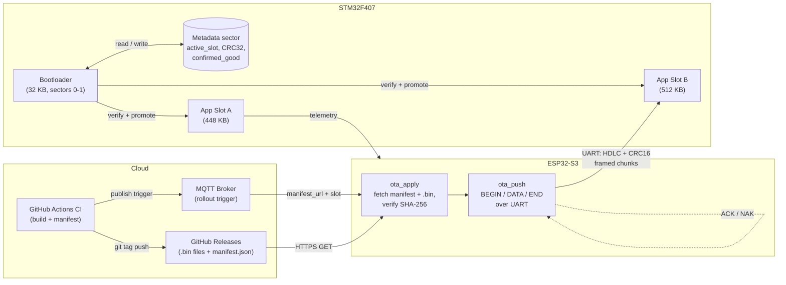
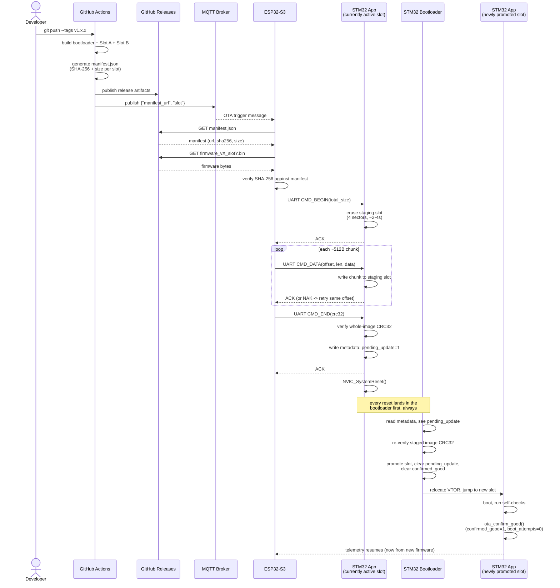

# STM32F407 OTA Update System — Design

## 1. Goal

Add field-updatable firmware to the STM32F407 node in the IoT project, using
the ESP32-S3 as the network-connected "delivery agent." The STM32 has no
network stack of its own; the ESP32 pulls the new firmware image over
MQTT/HTTPS and pushes it to the STM32 over the existing UART link using the
HDLC + CRC16 framing already in place.



*ESP32 is the only networked node — the STM32 has no network stack of its
own. Cloud→ESP32 is MQTT (trigger) + HTTPS (download); ESP32→STM32 is the
existing UART link, reusing the same HDLC+CRC16 framing already used for
sensor telemetry. Slot A/B roles are logical: whichever isn't currently
"active" per the metadata sector is always the staging target for the
next update.*

## 2. Flash layout (1 MB, F407VG)

| Region              | Sectors | Size   | Address range               |
|---------------------|---------|--------|------------------------------|
| Bootloader          | 0–1     | 32 KB  | 0x0800_0000 – 0x0800_8000    |
| Metadata            | 2       | 16 KB  | 0x0800_8000 – 0x0800_C000    |
| Reserved            | 3       | 16 KB  | 0x0800_C000 – 0x0801_0000    |
| App Slot A (active) | 4–7     | 448 KB | 0x0801_0000 – 0x0808_0000    |
| App Slot B (staging)| 8–11    | 512 KB | 0x0808_0000 – 0x0810_0000    |

Slot A/B roles are logical, not fixed to these addresses — the metadata
sector records which slot is currently "active" and the bootloader jumps
there. The other slot is always the "staging" target for the next update.

## 2b. End-to-end sequence — a complete update, start to finish



**The failure path** (new image hangs/crashes before confirming) isn't
shown above for clarity — see Section 5 (bootloader rollback logic): the
bootloader re-enters on every reset, increments `boot_attempts` each time
`confirmed_good` is still unset, and after `MAX_BOOT_ATTEMPTS` flips
`active_slot` back to the previous (already-proven) slot automatically —
no human intervention required.


## 3. Metadata sector layout

Single struct, written with a simple wear-friendly append/overwrite scheme
(see `flash_metadata.h`). Fields:

- `magic` — sanity check the sector was actually initialized
- `active_slot` — 0 = Slot A, 1 = Slot B
- `pending_update` — set by the app (or bootloader after a fresh flash) when
  a new image has been fully written to the staging slot and is ready to test
- `staging_size` / `staging_crc32` — size and CRC of the image sitting in the
  staging slot, checked before ever jumping to it
- `boot_attempts` — incremented by the bootloader each time it boots the
  *newly activated* slot without having seen a "confirmed good" flag; rolled
  back after N failed boots
- `confirmed_good` — set by the *application itself*, a few seconds after
  boot, once it has verified its own sanity (sensors respond, MQTT test
  publish succeeds, etc). This is what turns a successful boot into a
  permanent one.

## 4. Update flow

1. App is running normally from its active slot, doing its regular
   sensor/CAN/UART work.
2. ESP32-S3 receives an MQTT "update available" message with URL + expected
   SHA-256 + version string.
3. ESP32-S3 downloads the `.bin` over HTTPS, verifies the hash itself first
   (cheap, avoids wasting UART bandwidth on a corrupt file).
4. ESP32-S3 streams the image to the STM32 over UART using framed chunks
   (`OTA_DATA` frames, see `esp32_host/ota_uart_protocol.md`). The STM32 side
   (a small OTA-receiver module linked into the *application*, not the
   bootloader) writes each chunk to the staging slot as it arrives.
5. On the final chunk, STM32 computes CRC32 over the whole staged image and
   compares to the CRC32 the ESP32 sent. If it matches: write metadata
   (`staging_size`, `staging_crc32`, `pending_update = 1`), then reset.
6. Bootloader runs on reset, sees `pending_update`, verifies the staged
   image's CRC32 again (defense in depth against a botched metadata write or
   partial power loss), and if it's good:
   - flips `active_slot` to the staging slot
   - clears `pending_update`
   - clears `confirmed_good` (must be re-earned by the new image)
   - resets `boot_attempts` to 0
   - jumps to the new active slot
7. New app boots. It must call `ota_confirm_good()` (see
   `app_ota_client/src/ota_confirm.c`) within a grace period after
   self-checks pass. If it never does (crash, hang, watchdog reset loop),
   the bootloader's `boot_attempts` counter climbs on each reset, and past
   the threshold it rolls back to the previous slot automatically.

## 5. Rollback logic (bootloader, every reset)

```
read metadata
if metadata.magic invalid:
    initialize metadata (active_slot = A, all flags clear)
if pending_update set:
    verify staged image CRC
    if valid: promote staging -> active, clear pending_update, boot_attempts=0
    if invalid: clear pending_update, stay on current active_slot
if NOT confirmed_good:
    boot_attempts++
    if boot_attempts > MAX_BOOT_ATTEMPTS:
        active_slot = other_slot   // roll back
        boot_attempts = 0
        confirmed_good = 1         // trust the previous slot, it was already proven
relocate vector table to active_slot base
jump to active_slot reset handler
```

## 6. Files in this project

```
bootloader/
  src/main.c              - bootloader entry, verify + jump logic
  src/flash_metadata.c     - read/write/init metadata sector
  src/crc32.c              - CRC32 (same poly you'd use on ESP32 side)
  src/flash_ll.c           - low-level HAL flash erase/program wrappers
  inc/*.h
linker/
  bootloader.ld            - bootloader-only linker script (32 KB region)
  app_common.ld             - template app linker script, ORIGIN is a #define
app_ota_client/
  src/ota_receiver.c        - runs in the app; receives HDLC frames, writes to staging slot
  src/ota_confirm.c         - app calls this after self-check to set confirmed_good
  src/jump_to_bootloader.c  - app can force a reboot into "check for update" mode
esp32_host/
  ota_uart_protocol.md      - frame format/state machine for the ESP32 side
```

## 7. Practical notes

- F407 flash sectors are large (16/64/128 KB) and slow to erase (~1 s for a
  128 KB sector) — erase the whole staging slot *once* at the start of a
  transfer, not per-chunk.
- Never erase or write the bootloader's own sectors from the bootloader or
  app. There is intentionally no code path that does this.
- The reserved sector (sector 3) is spare — useful later for a second
  metadata copy (A/B metadata) if you want to protect against a torn write
  during the metadata update itself. Not implemented here to keep v1 simple,
  called out in code comments as a TODO.
- `SCB->VTOR` relocation is mandatory — without it, the freshly-jumped app's
  interrupt/exception vectors still point at the bootloader's table and any
  interrupt will crash into the wrong handler.
