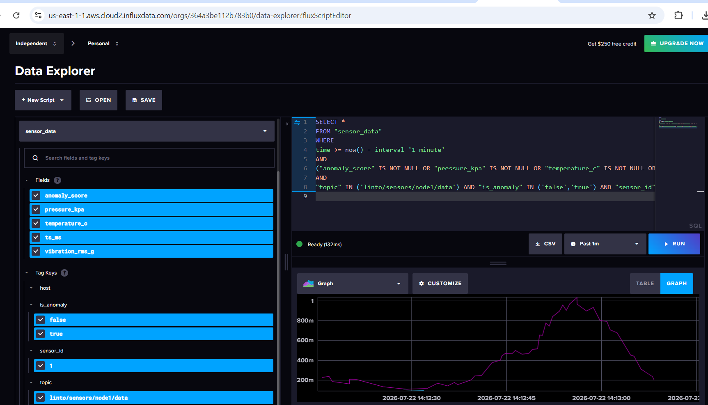
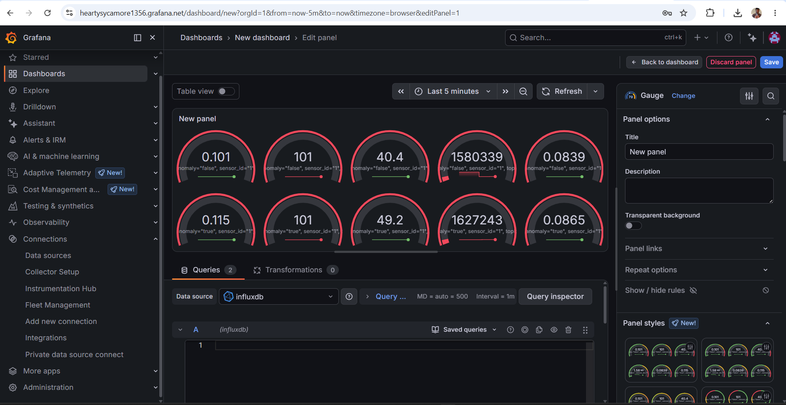

# Industrial IoT Sensor Pipeline: STM32 + ESP32-S3 + On-Device AI + MQTT + InfluxDB/Grafana

An end-to-end industrial telemetry pipeline: an STM32 samples sensor data,
runs on-device anomaly detection with a TinyML autoencoder, hands off to
an ESP32-S3 over UART, which publishes to MQTT — and from there the data
flows into InfluxDB and Grafana for storage and visualization.

## Pipeline overview

```
+----------------+     UART / HDLC      +------------------+     MQTT publish       +----------------+
|     STM32      |     framing with     |     ESP32-S3     |     to topics:         |     HiveMQ      |
|  FreeRTOS +     |     CRC16-CCITT      |  WiFi/MQTT +      |     .../data           |  public broker  |
|  AI inference   | -------------------> |  store/forward    | ---------------------> |  (unauthenticated) |
|  (autoencoder)  |                      |  ring buffer      |     .../diag           |                |
|                |                      |                   |     .../alert          |                |
+----------------+                      +------------------+                        +--------+-------+
                                                                                              |
                                                                                              | mqtt_consumer
                                                                                              | (subscribes to
                                                                                              |  all 3 topics)
                                                                                              v
+----------------+     Flux queries     +------------------+     influxdb_v2 write   +----------------+
|  Grafana Cloud  | <-------------------  |  InfluxDB Cloud   | <---------------------  |    Telegraf     |
|  dashboards &   |     (read token)      |  iot_telemetry    |     (write token)       |  MQTT -> Influx |
|  alert panels   |                      |  bucket            |                        |  bridge process |
+----------------+                      +------------------+                        +----------------+
```

**How to read this:** sensor data is generated on the STM32, physically hops
over UART to the ESP32-S3, gets published to MQTT topics on the HiveMQ
broker, and from there two separate downstream tools pick it up — Telegraf
pulls it into InfluxDB for storage, and Grafana queries InfluxDB to render
it as dashboards. Telegraf and Grafana never talk to each other directly;
InfluxDB sits between them as the shared datastore.

## Project status (current)

- **STM32 side**: FreeRTOS with priority-separated tasks, MPU6050 I2C driver,
  CMSIS-DSP FFT-based vibration analysis (RMS + peak frequency), fault
  threshold detection, and a HardFault handler that captures CFSR/HFSR/MMFAR/BFAR
  register state and persists it across warm resets via a NOINIT RAM section.
- **ESP32-S3 side**: non-blocking UART frame parsing, WiFi/MQTT with
  exponential backoff reconnect, a store-and-forward RAM ring buffer, and
  JSON MQTT publishing.
- **Shared protocol layer**: HDLC-style byte-stuffing with CRC16-CCITT
  framing, designed for future RS-485 Modbus RTU multi-drop scaling.
- **Broker**: public HiveMQ broker (`broker.hivemq.com:1883`), topics:
  - `linto/sensors/node1/data`
  - `linto/sensors/node1/diag`
  - `linto/sensors/node1/alert`
- **Visualization/storage layer (in progress)**: Telegraf subscribes to all
  three MQTT topics and writes into InfluxDB Cloud (`iot_telemetry` bucket).
  Telegraf → InfluxDB write path is confirmed working. Grafana Cloud
  dashboarding is the next step (data source + panels not yet built).
- **Known issue**: ESP-IDF v6.0.2 build/flash on Windows — MQTT component
  moved to Component Registry, `esp_driver_uart` replacing the monolithic
  driver component; intermittent "No serial data received" on COM6, likely
  needs manual BOOT+RESET bootloader entry.

## Planned next steps

- TLS/auth on the MQTT broker (moving off the public unauthenticated broker)
- OTA updates
- BLE WiFi provisioning
- Grafana dashboard build-out

---

# On-Device Vibration Anomaly Detection: STM32 + STM32Cube AI Studio + ESP32-S3 + MQTT

Extends `stm32_sensor_sim` / `esp32_sensor_sim` with an autoencoder that
runs directly on the STM32, flagging abnormal sensor patterns before the
data ever leaves the device. This is the standard TinyML pattern for
industrial predictive maintenance: train on normal operating data only,
deploy a small model, flag high reconstruction error as anomalous.

## Pipeline overview

```
[Python/Keras]                    [STM32Cube AI Studio]
train autoencoder on   ────────>  import .h5/.tflite, generate
normal simulated data             optimized C code for your MCU
        |                                    |
        v                                    v
anomaly_model.h5/.tflite   +   network.c/.h, network_data.c/.h
                     \         /
                      \       /
                       v     v
              stm32_sensor_sim_ai/
              (Core/Src/ai_inference.c wraps the generated API)
                       |
                       | UART, HDLC frame now includes
                       | anomaly_score + is_anomaly
                       v
              esp32_sensor_sim_ai/
              (publishes to .../data, and to .../alert when flagged)
```

## Step 1: Train the model (on your PC)

```bash
cd ai_training
pip install tensorflow numpy --break-system-packages
python train_anomaly_model.py
```

This generates synthetic "normal" data using the same formulas as the
STM32 simulator, trains a small autoencoder (30 inputs -> 16 -> 4
bottleneck -> 16 -> 30 outputs), and prints:
- The normalization constants (`feature_mean[]`, `feature_std[]`)
- The anomaly threshold (mean + 3 std of validation reconstruction error)
- A sanity check confirming an injected vibration spike is correctly flagged

It also saves `anomaly_model.h5` and `anomaly_model.tflite`.

**Copy the printed constants into `stm32_sensor_sim_ai/Core/Inc/ai_inference.h`**,
replacing the placeholder `ANOMALY_THRESHOLD`, `feature_mean[]`, and
`feature_std[]` values.

## Step 2: Deploy with STM32Cube AI Studio

1. Install STM32Cube AI Studio (Espressif-equivalent tool from ST,
   downloadable from ST's developer site - it may prompt you to also
   have STM32CubeIDE and STM32CubeMX installed, since it integrates
   with both).
2. New Project -> import `anomaly_model.h5` (or the `.tflite` file).
3. Select your target: STM32F407 or STM32F411 depending on your board.
4. Run **Analyze** - this reports RAM/Flash footprint and estimated
   inference cycles for your specific MCU. A model this small (30-16-4-16-30)
   should be well within budget for an F4-class MCU (typically a few KB
   of Flash, well under 1ms inference time).
5. Run **Validate on target** (optional but recommended) - this flashes
   a validation firmware and confirms the on-device output matches the
   Python model's output within acceptable tolerance.
6. Click **Generate code**. This produces `network.c`, `network.h`,
   `network_data.c`, `network_data.h`, and the AI runtime platform files.

## Step 3: Wire the generated code into the firmware

1. Copy the generated files into `stm32_sensor_sim_ai/` - typically
   under `Core/Inc` and `Core/Src`, or a subfolder like `X-CUBE-AI/App`
   depending on which generation mode you used. STM32Cube AI Studio
   tells you the exact output path at the end of generation.
2. Add that folder to your STM32CubeIDE project's include paths
   (Project Properties -> C/C++ Build -> Settings -> Include Paths).
3. Open `Core/Src/ai_inference.c` and uncomment the blocks marked
   `Uncomment once network.h is generated and wired in` (there are two:
   one in `ai_inference_init()`, one in `ai_inference_update()`).
4. If you named your model something other than the default in
   STM32Cube AI Studio, find-and-replace `network` with your actual
   model name throughout `ai_inference.c` - the generated function
   prefixes follow your model's name.
5. Build. If you get undefined reference errors, double-check the
   generated `network_data.c` (containing the trained weights) is
   included in your build sources, not just the header.

## Step 4: Build and flash both sides

STM32 side - same as before:
```
Build in STM32CubeIDE, flash to your F407/F411.
```

ESP32 side:
```bash
cd esp32_sensor_sim_ai
idf.py set-target esp32s3
idf.py build
idf.py -p COM6 flash monitor
```

## What you'll see

Normal operation on the `.../data` topic:
```json
{"sensor_id":1,"ts_ms":123456,"temperature_c":46.1,"vibration_rms_g":0.85,
 "pressure_kpa":101.4,"anomaly_score":0.021,"is_anomaly":false}
```

When the simulated vibration spike hits (every ~20 samples, per the
`spike` logic in STM32 `main.c`), you'll additionally see a message land
on `.../alert`:
```json
{"sensor_id":1,"ts_ms":128456,"temperature_c":46.3,"vibration_rms_g":3.4,
 "pressure_kpa":101.5,"anomaly_score":0.187,"is_anomaly":true}
```

## Before the network is wired in

`ai_inference.c` ships with the generated-network calls commented out
and a passthrough placeholder in their place, so the whole pipeline -
UART framing, CRC, MQTT, JSON - is testable end-to-end before you've
touched STM32Cube AI Studio at all. With the placeholder active,
`anomaly_score` will always read ~0 and `is_anomaly` will always be
false, since the "reconstruction" is just the input copied back out.
That's expected - it confirms the plumbing works before you add the
actual model.

## Tuning after first deployment

- If you get too many false positives, raise `ANOMALY_THRESHOLD` in
  `ai_inference.h`, or retrain with a larger `N_SAMPLES` / wider noise
  ranges in `train_anomaly_model.py` so the model treats more of your
  real operating envelope as "normal."
- Once you swap simulated values for real MPU6050 reads, retrain on
  logged real "normal" operation data rather than the synthetic
  formulas - the synthetic data is only a stand-in to prove the
  pipeline works before real sensor data is available.

---

# Visualization & Storage: MQTT → Telegraf → InfluxDB Cloud → Grafana Cloud

Once sensor data lands on the MQTT broker, Telegraf bridges it into
InfluxDB Cloud for storage, and Grafana Cloud reads from InfluxDB to
render dashboards. Neither Telegraf nor Grafana touch the firmware —
they sit entirely downstream of the existing MQTT publish step.

## Setup

1. **InfluxDB Cloud** — create an account, a bucket (`iot_telemetry`),
   and two scoped API tokens: one Write-only (for Telegraf) and one
   Read-only (for Grafana).
2. **Telegraf** — install locally, configure an `mqtt_consumer` input
   per topic (`data`, `diag`, `alert`) pointed at the HiveMQ broker,
   and an `influxdb_v2` output pointed at the InfluxDB Cloud bucket
   using the write token (kept as an environment variable, not
   hardcoded in the config).
3. **Grafana Cloud** — create an account, add InfluxDB as a data
   source (Flux query language, read token), and build panels for
   `vibration_rms_g`, `temperature_c`, `pressure_kpa`, and
   `anomaly_score`, plus a filtered view on `is_anomaly == true` to
   surface alert events.

## Status

Telegraf → InfluxDB write path confirmed working. Grafana data source
connected and first dashboard panels built.

## Results

**InfluxDB Data Explorer** — querying `sensor_data` for the last minute,
filtered on the `linto/sensors/node1/data` topic, showing `anomaly_score`
rising toward a spike:



**Grafana dashboard** — gauge panels split by `is_anomaly` (false/true),
showing `anomaly_score`, `pressure_kpa`, `temperature_c`, `ts_ms`, and
`vibration_rms_g` side by side for direct comparison between normal and
flagged readings:



## Notes

- `ts_ms` in the sensor payload is a device uptime counter, not epoch
  time — until firmware sends real epoch time, Telegraf is configured
  to stamp arrival time instead of parsing `ts_ms` directly.
- The public HiveMQ broker requires no auth, which simplifies the
  Telegraf MQTT input for now — TLS/auth is a planned follow-up once
  the broker moves off the public instance.
